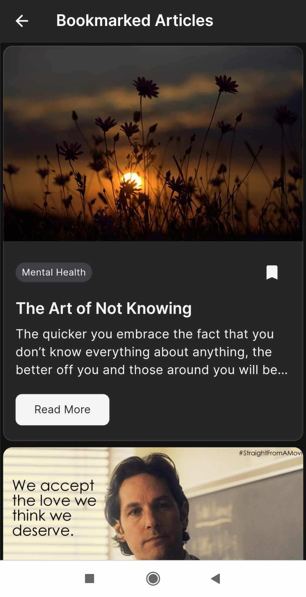

# Essence App Guide

## Description

Essence is a web application built using Flutter, a UI toolkit for crafting natively compiled mobile, web, and desktop applications from a single codebase. This aims to educate users on the importance of mental health, raise awareness about STD and HIV prevention and treatment, and support LGBT rights by providing relevant resources and advocacy information.

## Getting Started

1. **Install Dependencies**:
   Ensure Flutter is set up and dependencies are installed:

```
flutter pub get
```

## Navigating the App

### Light and Dark Mode

- **Switching Modes**:
Tap the mode toggle button in the app bar to switch between light and dark modes.

### Navigation Bar

- **Home**:
Explore articles covering mental health, HIV/STD, and SOGIE SC topics.

- **Bookmark**:
Access and manage bookmarked articles.

### Search Bar

- **Searching Articles**:
Use the search bar to find articles by keywords or topics.

### Filters

- **Category Filters**:
Choose from categories like "All", "Mental Health", "HIV and STD", and "SOGIE SC" to filter articles.

### Bookmarking Articles

- **Bookmarking**:
Bookmark articles by tapping the bookmark icon on each article. Access bookmarked articles in the Bookmark section.


## Screenshots

<p align="center">
  
  
  
  
</p>

<p align="center">
  
  
  
</p>

## Demo

- **[View Demo](https://appdevproject-4c2b2.web.app/)**
